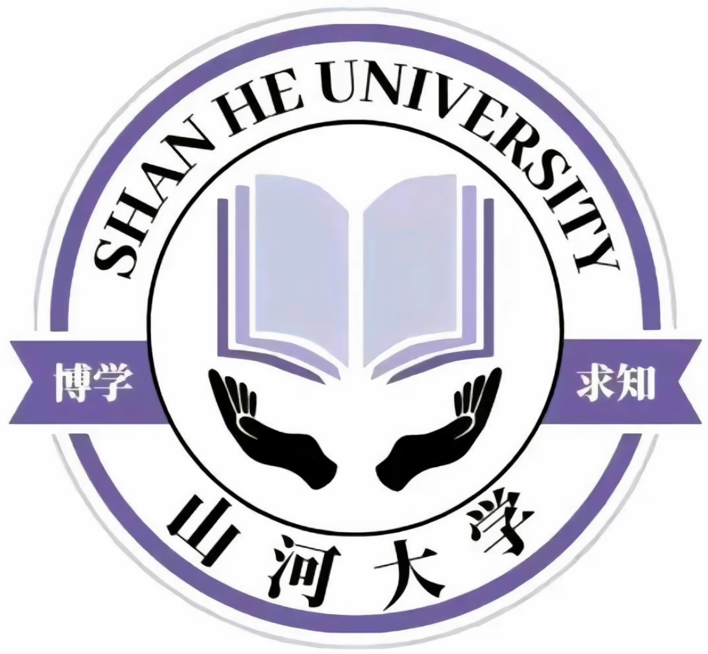

# Shan He University

The Shan He University (SHU) is a public virtual comprehensive university in China.
After the [Gaokao](https://en.wikipedia.org/wiki/Gaokao) in 2023, students from four densely populated provinces (Henan, Hebei, Shandong and Shanxi) decide to create SHU to provide high quality education to local people.
Founded in response to the increasing demand of top tier education equivalent to big cities like Beijing and Shanghai, the initial goal of SHU is to surpass [THU](https://www.tsinghua.edu.cn/en/) in 3 years, and [PKU](https://english.pku.edu.cn/) in 5 years, which are top 2 universies in China. 
The location of SHU is aimed at the border of those four provinces, so students can stay close to their hometown.
To comprise many years of lost of local students, SHU provides equal education oppurtunity to every local people.
For all other students, the minimum requirement of Gaokao score is 700 out of 750. 
